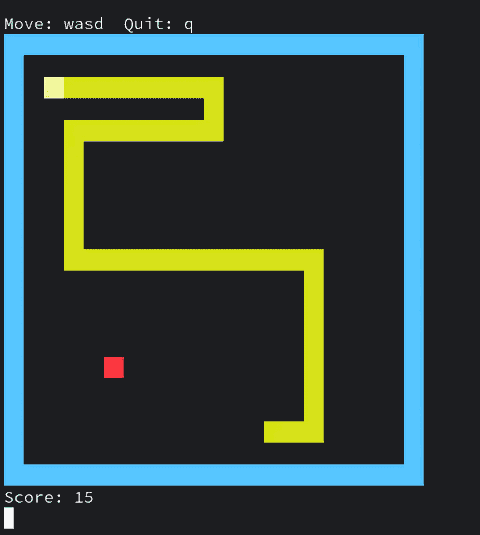

# snake-asm

I wanted to learn some assembly language, so I made this tiny snake game for x86_64 Linux using [NASM](https://www.nasm.us/).



## Download binary

You can download a compiled version of the game from the [releases page](https://github.com/NikitaIvanovV/snake-asm/releases/).

## Compile and install

*[NASM](https://www.nasm.us/) is required in order to compile the game.*

```sh
git clone https://github.com/NikitaIvanovV/snake-asm
cd snake-asm
sudo make install
```

Uninstall with `sudo make uninstall`
